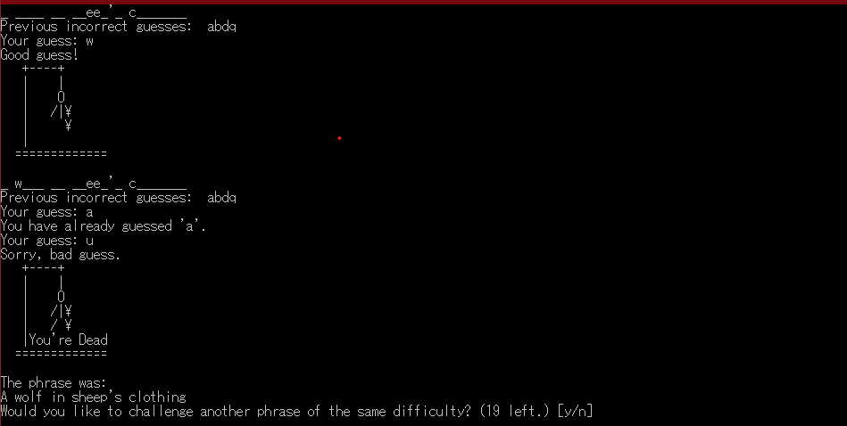
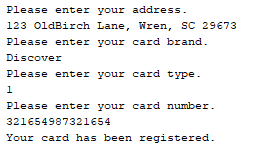
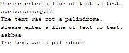

Portfolio
=========

Programming Projects
--------------------

---
### [Final Group Project | CSCI 332](project3)

---
### [Final Project | CSCI 419](project4)

---
### [Lab 07 | CSCI 325](project1)

---
### [Lab 09 | CSCI 325](project2)

---

Ethics Papers
-------------

### [Ethics Paper](/pdf/NetworkingPaper.docx)

-   **Class: CSCI 332**  
-   **Grade: 90**

### [Ethics for a Student in the Modern Era](/pdf/EthicsPaperCSCI325.docx)

-   **Class: CSCI 325** 
-   **Grade: 85**

### [Account Created in 1984 - Ethics in Modern Technology](/pdf/235Paper.docx)

-   **Class: CSCI 235** 
-   **Grade: 100**

---

Presentations
-------------

### [Bombplace Narration](/pdf/bombPlacePaulMcGlothlin.flv)

- **Class: CSCI 325** 
- **Grade: 80**

### [CSCI 352 Group Handout Presentation](/pdf/CSCI352ContingencyPlanningProject–McGlothlinHarrison.docx)

- **Class: CSCI 352** 
- **Grade: 100**
- **A handout given to students as part of our presentation on Contingency Planning. It was utilized to give the presentation with the students following along.**

---

Page template forked from <a href="https://github.com/csu-cs/csci-portfolio">CSU-CS</a>

<!-- Remove above link if you don't want to attributive -->
