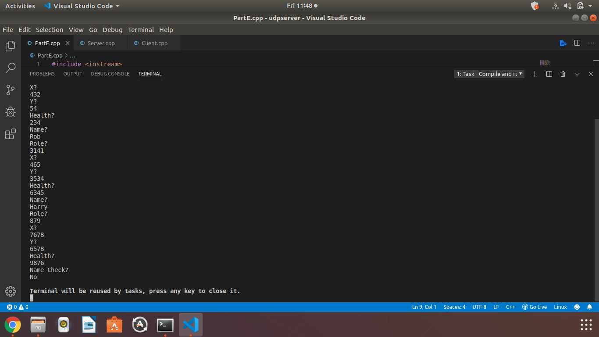

Portfolio
=========

[View My Resume](/pdf/paul_resume.pdf)
--------------------

Programming Projects
--------------------

---
### [Final Group Project | CSCI 332](project3.md)

---
### [Team Project | CSCI 334](project4.md)

---
### [Lab 07 | CSCI 325](project1.md)

---
### [Lab 11 | CSCI 315](project2.md)

---

Ethics Papers
-------------

### [Ethics Paper](essay1.md)

-   **Class: CSCI 332**  
-   **Grade: 90**

### [Ethics for a Student in the Modern Era](essay2.md)

-   **Class: CSCI 325** 
-   **Grade: 85**

### [Account Created in 1984 - Ethics in Modern Technology](essay3.md)

-   **Class: CSCI 235** 
-   **Grade: 100**

---

Presentations
-------------

### [CSCI 325 Group: Bombplace Narration](/pdf/bombPlacePaulMcGlothlin.flv)

- **Class: CSCI 325** 
- **Grade: 80**
- **Narration of my part in the final group project in 325.**

### [CSCI 352 Group Handout Presentation](/pdf/CSCI352ContingencyPlanningProject–McGlothlinHarrison.docx)

- **Class: CSCI 352** 
- **Grade: 100**
- **A handout given to students as part of our presentation on Contingency Planning. It was utilized to give the presentation with the students following along.**

### [CSCI 419 Final: Delivery 5](/pdf/Delivery5.pptx)

- **Class: CSCI 419** 
- **Grade: 90**
- **A powerpoint presentation to be turned in with the SQL from the project above. Details the features of the project.**

---

Page template forked from <a href="https://github.com/csu-cs/csci-portfolio">CSU-CS</a>

<!-- Remove above link if you don't want to attributive -->
