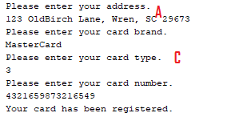

[Back to Portfolio](./)

CSCI 325 Lab 07
===============

-   **Class: CSCI 325** 
-   **Grade: 83**
-   **Language(s): Java**
-   **Source Code Repository:** [CSCI 325 Lab 07](https://github.com/paulryanmc/325-Lab-07)  

## Project description

Java project designed to take input from the user and judge it according to several predefined standards:

|A| Is the first string a valid address in the format of "Street, City, State ZIP"? (ie: 123 OldBirch Lane, Wren, SC 29673)

|B| Is the second string a valid credit card brand? (Visa, American Express, Discover, Mastercard)

|C| Is the third string a valid card type? (Numbers 1-4)

|D| Is the last string a valid credit card number? (String of numbers either 15 or 16 characters in length based on the starting number)

To properly utilize these files, combine the relevant classes into a .jar file through a dedicated program or command line.

Example command line:

jar cf jar-file input-file(s)

In an IDE such as Netbeans, the process should more or less done for you during the build process, or can be quickly done by importing the classes.
Consult the material for your IDE.

