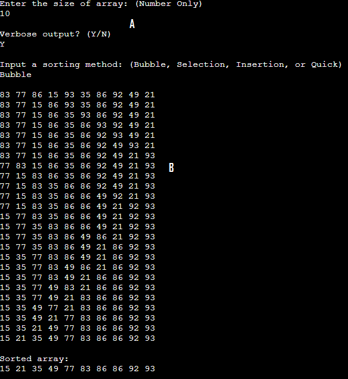
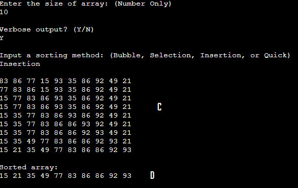

[Back to Portfolio](./)

CSCI 315 Lab 11
===============

-   **Class: CSCI 315** 
-   **Grade: 80**
-   **Language(s): C++**
-   **Source Code Repository:** [CSCI 315 Lab 11](https://github.com/paulryanmc/315-Lab-11)  

## Project description

C++ project to showcase the different sorting methods for arrays and similar data structures. Features Bubble, Selection, Insertion, and Quick sorting.

Fig 1.  \
A. Console output requesting input from the user to configure array size and settings  \
B. Verbose bubble sorting output showing line by line changes

Fig 2.  \
C. Verbose insertion sorting output showing line by line changes \
D. Sorted array output

Compiling C++ varies based on your compiler of choice and operating system.

Example command line for Windows with MinGW: g++ <.cpp files>

Example command line for Linux with gcc: gcc program-source-code.c -o executable-file-name

IDEs often come with built-in compilers. Consult your IDE's material.

