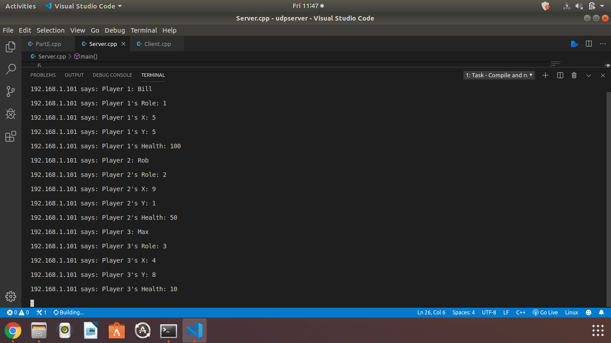
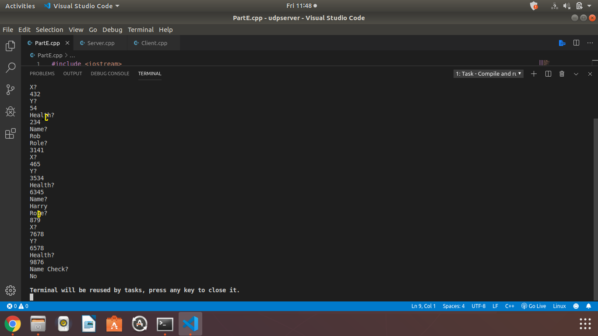

[Back to Portfolio](./)

CSCI 332 Final Group Project
===============

-   **Class: CSCI 332** 
-   **Grade: 90**
-   **Language(s): C++**
-   **Source Code Repository:** [CSCI 332 Final Group Project](https://github.com/paulryanmc/332-Team-Project)  
-   **Teammates: Thomas J. Ramsey**

## Project description

Project that utilizes a local server to play a game with another party that involves running into each other to deal damage.

Pictured above: Log of an in progress game showing the local IP the server is currently utilizing and the players X and Y coordinates in the game, along with their health and roles.

|A| Local IP Address
|B| Player Number
|C| Player Health
|D| Player Role

Compiling C++ varies based on your compiler of choice and operating system.

Example command line for Windows with MinGW:
g++ <.cpp files>
  
Example command line for Linux with gcc:
gcc program-source-code.c -o executable-file-name

IDEs often come with built-in compilers. Consult your IDE's material.
