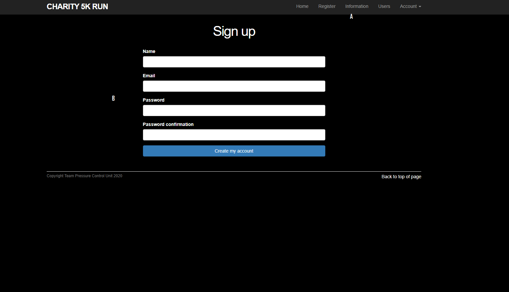
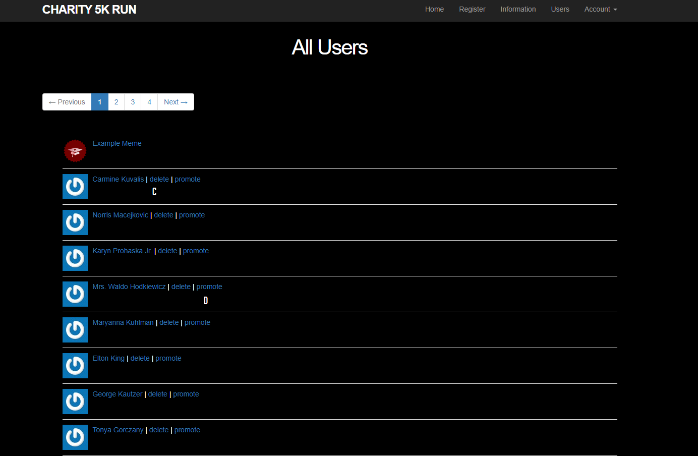

[Back to Portfolio](./)

CSCI 334 Team Project
===============

-   **Class: CSCI 334** 
-   **Grade: 90**
-   **Language(s): Ruby**
-   **Source Code Repository:** [CSCI 334 Team](https://github.com/paulryanmc/334-Team)  
-   **Teammates: Benjamin Blauch, Matthew Yanzer, Kaitlyn Crews**

## Project description

Ruby-based sample website created as part of a team for CSCI 334.
Promotes a COVID-19 Charity 5K Run and includes a login system and accompanying database to support admin accounts and additional signups.
**Example Website Deploy:** [CSCI 334 Team Example](http://gentle-caverns-07357.herokuapp.com/)

Fig 1.  \
A. Global directory with access to the various pages on the website    \
B. New user signup functionality that allows users to create an account with the inputted Name, Email, and Password

Fig 2.  \
C. Admin access to the site-wide user database, specifically the delete functionality that allows an admin to remove an account  \
D. Promotion functionality that allows the admin to ascend other users to admin status

To run this application: First, make sure to pull all code from GitHub into a subfolder within your file tree Next, run rails db:migrate in the command line to set up the database Run rails db:migrate:reset to remove any previous data stored in the database Finally, run db:seed to generate 1 initial admin and 99 users The admin login is example@railstutorial.org, password: foobar To access the site run rails server and preview the running application. From there you can create any new users, and use the default admin to promote any users
